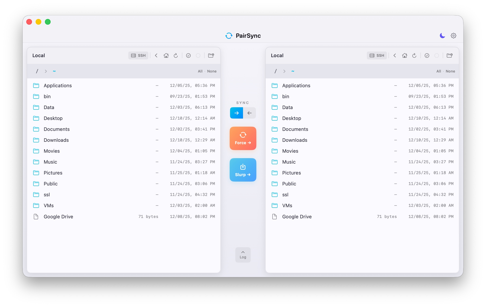

# PairSync

A beautiful dual-pane file synchronization app for macOS, built with SwiftUI.



**No Xcode required** — just `swift build` and run!

## Features

- **Dual-Pane Browser**: View source and destination side-by-side
- **Remote SSH Browsing**: Connect either pane to a remote server via SFTP
- **Selective Sync**: Select specific files/folders or sync entire directories
- **Safety Confirmation**: Warns before syncing entire directories
- **Two Sync Modes**:
  - **Force**: `rsync -haz --info=name,del --delete --force-delete` (mirror, deletes extras)
  - **Slurp**: `rsync -haz --info=name` (copy only, preserves destination)
- **Bidirectional**: Sync left→right or right←left
- **Light/Dark Theme**: Toggle with sun/moon button, persists across sessions
- **Live Log**: Real-time rsync output with auto-refresh on completion
- **Context Menu**: Right-click to open, select, or delete files
- **Custom App Icon**: Beautiful sync icon matching the app design

## Requirements

- macOS 14.0+ (Sonoma)
- Swift 5.9+ (for building from source)
- rsync 3.x from Homebrew (recommended)
- SSH key authentication configured (for remote connections)

## Setup

### Install rsync (Required)

PairSync works best with the Homebrew version of rsync, which has more features than the older macOS system version:

```bash
brew install rsync
```

Verify it's installed:

```bash
rsync --version
# Should show: rsync  version 3.x.x
```

### SSH Key Setup (For Remote Connections)

If you plan to sync with remote servers, set up passwordless SSH:

```bash
# Generate a key if you don't have one
ssh-keygen -t ed25519

# Copy your key to the remote server
ssh-copy-id user@hostname

# Test the connection (should not prompt for password)
ssh user@hostname "echo Connected!"
```

## Install

### Via Homebrew (Recommended)

```bash
brew tap shreeve/tap
brew install --cask pairsync
```

### Download DMG

Download from [GitHub Releases](https://github.com/shreeve/pairsync/releases)

## Build from Source

### Quick Start (Debug Build)

```bash
swift build && .build/debug/PairSync
```

### Standalone App Bundle

Build a proper `.app` that runs independently:

```bash
./Scripts/build-app.sh
open dist/PairSync.app
```

Or create a DMG for distribution:

```bash
./Scripts/build-app.sh --dmg
```

See [LAUNCH.md](LAUNCH.md) for details on how standalone app bundles work.

## Usage

### Local Browsing

1. Both panes start at your home directory
2. Double-click folders to navigate
3. Use breadcrumbs or navigation buttons to move around
4. Click the folder+ icon to open a directory picker

### Remote SSH Browsing

1. Click the **SSH** button in any pane's header
2. Enter `user@hostname` (e.g., `deploy@server.com`)
3. Press **Enter** or **⌘Enter** to connect
4. Browse the remote filesystem just like local files!

The pane will show a **green border** when connected remotely.

### Selecting Files

- **Click** a file/folder to select (checkmark appears)
- **Click again** to deselect
- Use **All / None** links in breadcrumb bar
- Use header icons: ✓○ (select all) and ○ (select none)
- Keyboard shortcuts for each pane (see below)

### Syncing

1. **Select files** (optional) — click to select, click again to deselect
2. **Choose direction** by clicking the arrow toggle (→ or ←)
3. Click **Force** or **Slurp** to sync

**Selective Sync:**
- Files selected → syncs only those items (folder itself, not just contents)
- No files selected → confirmation dialog, then syncs entire directory

### Right-Click Context Menu

Right-click any file or folder for:
- **Open** — Navigate into folder
- **Select/Deselect** — Toggle selection
- **Delete** — Remove with confirmation (works local and remote!)

### Keyboard Shortcuts

| Keys | Action |
|------|--------|
| **Sync** | |
| ⇧⌘F | Force Sync → |
| ⇧⌘S | Slurp Sync → |
| ⌥⌘F | ← Force Sync |
| ⌥⌘S | ← Slurp Sync |
| **Selection** | |
| ⇧⌘A | Select All - Left Pane |
| ⌥⌘A | Select All - Right Pane |
| ⇧⌘D | Deselect All - Left Pane |
| ⌥⌘D | Deselect All - Right Pane |
| **Connection** | |
| ⌘↩ | Connect (in SSH field) |

## Sync Combinations

| Left Pane | Right Pane | Use Case |
|-----------|------------|----------|
| Local | Local | Backup between drives |
| Local | Remote | Deploy to server |
| Remote | Local | Download from server |
| Remote | Remote | Server-to-server sync |

## Project Structure

```
pairsync/
├── Package.swift
├── README.md
├── LAUNCH.md
├── Resources/
│   └── AppIcon.icns          # App icon
├── Scripts/
│   ├── build-app.sh          # Creates standalone .app bundle
│   └── create-icon.swift     # Generates app icon from SF Symbols
└── Sources/
    ├── PairSyncApp.swift     # App entry point & menu commands
    ├── Models.swift          # Data models, SyncManager, ThemeManager
    ├── ContentView.swift     # Main layout
    ├── FileBrowserPane.swift # File list + SSH connection
    ├── SyncControls.swift    # Sync buttons & direction toggle
    ├── LogPanel.swift        # rsync output viewer
    └── SettingsSheet.swift   # Settings modal
```

## Version

0.6.0

## License

MIT
